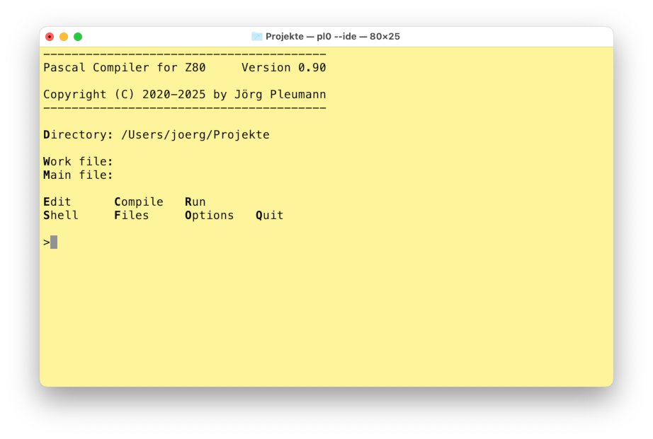

# PASTA/80

PASTA/80 is a simple [Pascal](https://en.wikipedia.org/wiki/Pascal_(programming_language)) cross compiler targeting the [Z80](https://en.wikipedia.org/wiki/Zilog_Z80) microprocessor. It generates code for these classic and modern machines:

* [CP/M](https://en.wikipedia.org/wiki/CP/M)
* [ZX Spectrum 48K](https://en.wikipedia.org/wiki/Sinclair_ZX_Spectrum)
* [ZX Spectrum 128K](https://en.wikipedia.org/wiki/ZX_Spectrum#ZX_Spectrum_128)
* [ZX Spectrum Next](https://www.specnext.com)

The compiler follows the single-pass recursive-descent approach championed by [Niklaus Wirth](https://de.wikipedia.org/wiki/Niklaus_Wirth), inventor of Pascal, in his books and lectures. It doesn't have an explicit syntax tree, but instead generates code on the fly during parsing. As a result, the compiler might not always generate the most efficient code possible (it definitely cannot compete with LLVM and doesn't try to), but it's very fast.

## Supported language elements

The supported Pascal dialect is an almost exact clone of the original [Turbo Pascal 3.0](https://en.wikipedia.org/wiki/Turbo_Pascal) for CP/M (see [this manual](https://bitsavers.trailing-edge.com/pdf/borland/turbo_pascal/Turbo_Pascal_Version_3.0_Reference_Manual_1986.pdf) for details). So you have at your disposal the following language elements:

* All the basic data types (`Boolean`, `Byte`, `Char`, `Integer`, `Pointer`, `Real` and `String`).
* `array of`, `record`, `set of`, enumerations, subranges and pointers as a way of building new data types.
* The decision-making elements `if..then..else` and `case..of`.
* The loop elements `for..do`, `while..do` and `repeat..until`.
* The `with..do` notation for "opening" records.
* `procedure` and `function` including value and `var` parameters and nesting.
* The standard procedures for screen input and output (i.e. `ReadLn`, `WriteLn` etc.).
* All conversion and utility procedures and functions that Turbo Pascal 3.0 had.
* The three kinds of disk files, that is untyped (`file`), typed (`file of`) and `Text`.
* A dynamic heap of up to 32767 bytes with `GetMem`, `FreeMem`, `New` and `Dispose`.
* Inline assembly (via opcodes, not via mnemonics, so [this page](https://clrhome.org/table/) might be handy).
* Overlays (in memory, Spectrum 128K and Next only, see below).
* Some compiler directives:
  * `$i <file>` for including Pascal source files (including nesting and cycle detection)
  * `$l <file>` for including an assembly file (aka "linking" a library)
  * `$a(+/-)`   for enabling or disabling absolute mode (default is on, disable for recursion)
  * `$i(+/-)`   for enabling or disabling IO checking (when off, check `IOResult` after calls)
  * `$k(+/-)`   for enabling or disabling stack overflow checking
  * `$u(+/-)`   for enabling or disabling Ctrl-C checking

The compiler also has some features that were borrowed from or inspired by later versions of Turbo Pascal:

  * C-style `//` one-line comments in addition to `{..}` and `(*..*)`.
  * Binary literals (using a `%` prefix).
  * `Break` and `Continue` for loop control.
  * Querying the keyboard via `KeyPressed` and `ReadKey`.
  * Color support via `TextColor` and `TextBackground` with constants for the 8 Spectrum Next colors.
  * `Inc` and `Dec` for more efficient increasing and decreasing of variables.
  * `Include` and `Exclude` for more efficient handling of sets.
  * A simple `Assert` facility that counts passes/fails and shows the failed line number.

Since that covers most of the functionality of Turbo Pascal 3 you might ask what is missing. These are the current limitations:

* All the remaining compiler directives are not yet supported.
* `Mark`/`Release` are not currently supported.
* The standard files `Input`, `Output`, `Kbd`, `Con` and `Lst` are not supported.
* `Chain` and `Execute` are not supported.
* Add-on libraries from the PC version of Turbo Pascal 3.0 are not yet supported (although there are a few graphics primitives for the ZX targets).
* The [new instructions of the Z80N CPU](https://wiki.specnext.dev/Extended_Z80_instruction_set) inside the ZX Spectrum Next are not yet being leveraged.
* No separate compilation. Everything is compiled from source, always.
* Binary size is quite large compared to the original.

The runtime library, being partially written in Pascal itself, gets quite large when compiled. I hope to bring this down again by reimplementing more of it in Z80 assembly (or improve the code generator, which, although it has a peephole optimizer, is not generating super-efficient Z80 code).

## Building and setting up the compiler

The compiler is itself written in Pascal. You can compile it with [Free Pascal](https://www.freepascal.org) (I use version 3.2.2). Just run

```bash
$ fpc pasta
```

The Pascal compiler generates Z80 assembler code and relies on [sjasmplus](https://z00m128.github.io/sjasmplus) as a backend for the final translation step to binary. It can also, in `--ide` mode (see below), make use of various other external tools. The compiler tries to detect these external tools automatically (from your system's `PATH`), but sometimes it's best to create a file `.pasta80.cfg` in your home directory specifying necessary paths (there is a sample in `misc` that you can adapt).

```
# PASTA/80 config

HOME      = ~/Spectrum/pasta80
ASSEMBLER = ~/Spectrum/sjasmplus/sjasmplus
...
```

You can check your whole setup by calling the compiler with `--config`. It will show the full paths of all internal and external requirements and whether they are fulfilled.

## Using the compiler

To run the compiler just invoke the executable with the name of a Pascal source file to translate.

### CP/M target

The default target is CP/M. There is an optional parameter that enables some simple peephole optimizations and another one that uses dependency analysis to eliminate unused Pascal procedures and functions:

```bash
$ pasta hello.pas             # Compiles hello.pas to hello.com
$ pasta hello                 # Source file .pas suffix is optional
$ pasta --opt hello.pas       # Enables peephole optimizations
$ pasta --opt --dep hello.pas # The same plus dependency analysis
```

You can run the resulting `.com` files on a real CP/M machine or in a CP/M emulator. I recommend the excellent [tnylpo](https://gitlab.com/gbrein/tnylpo). For programs that use VT52 control codes you have to start tnylpo in full-screen mode:

```bash
$ tnylpo hello                # Run in line-mode
$ tnylpo -s -t @ hello        # Monochrome full-screen, wait when finished
$ tnylpo -soy,4,0 -t @ hello  # Color full-screen, wait when finished
```

| "Hello, World" in line mode  | "Hello, World" in full-screen |
| :-------: | :----: |
|  |  |

### ZX Spectrum targets

To generate binaries for the ZX Spectrum 48K, 128K and Next targets, use the `--zx48`, `--zx128` and `--zxnext` parameters, respectively.

```bash
$ pasta --zx48 hello.pas      # Compiles for ZX Spectrum 48K
$ pasta --zx128 hello.pas     # Compiles for ZX Spectrum 128K
$ pasta --zxnext hello.pas    # Compiles for ZX Spectrum Next
```

The main difference between the three (currently) is that the ZX Spectrum Next target supports file IO (on the SD card), while the other two do not. The remaining routines are mostly the same. Screen output is handled via `rst $10` in the ROM. In both cases the binaries are expected to be run from address 0x8000.

### Tapes, snapshots and runnable directories

The default output format for the ZX Spectrum targets is a simple binary file that contains exactly the bytes of the compiled program (plus a +3DOS header when compiling for the Spectrum Next). In addition to that (and for more complex cases involving overlays), the compiler can also generate snapshot files or tape files, the latter including a suitable BASIC loader:

```bash
$ pasta --zx48 --sna examples/hello.pas   # .sna file
$ pasta --zx48 --tap examples/jacques.pas # .tap file with BASIC loader
```

Being self-contained, snapshots and tapes are a convenient way to distribute your programs and to launch them an emulator, such as Fuse:

```bash
$ open -a Fuse examples/hello.sna         # Launch .sna file in FUSE (on Mac)
$ open -a Fuse examples/jacques.tap       # Launch .tap file in FUSE (on Mac)
```

| Hello world in FUSE | Frere Jacques in FUSE (yes, with sound!) |
| :-------: | :----: |
|  |  |

When compiling for the Next, another useful format is a runnable directory. It contains exactly the same files that would also be in the .tap file, including a BASIC loader named `run.bas`.

```bash
$ pasta --zxnext --run examples/pq.pas    # Results in directory named pq.run
```

The directory has the suffix `.run`. When attempting to enter such a directory in the Next's file browser, the loader is started automatically (press Symbol Shift + Enter to really see the contents). If you are a Mac user: Yes, it's a bit like an `.app` bundle.

### Overlays

The Spectrum 128K and Next targets support overlays. This means you can have larger programs than would normally fit into the 64K address space of a Z80 machine. The rules are the same as for Turbo Pascal 3.0:

- Overlays can be applied to global procedures and functions only, not to nested ones (though nested ones will be overlaid if the containing ones are, too).
- Overlays cannot be applied to global variables, that is, you cannot use them for data (at least not without tricks).
- All consecutive procedures and functions that are marked as `overlay` go into the same overlay. Use any declaration in between to separate overlays.

In the following example, there are three overlays: Overlay 0 contains A and B, overlay 1 contains D, and overlay 2 contains E.

```pascal
overlay procedure A; (* Overlay 0 *)
begin
end;

overlay procedure B; (* Overlay 0 *)
begin
end;

procedure C; (* Not in an overlay *)
begin
end;

overlay procedure D; (* Overlay 1 *)
begin
end;

type
  Dummy = Integer;   (* Separator *)

overlay procedure E; (* Overlay 2 *)
begin
end;
```

In contrast to Turbo Pascal 3.0, overlays are not implemented via disk files. Instead, they use the additional RAM of the Spectrum 128K and Next machines. The uppermost 16K bank (Spectrum 128K) or 8K page (Spectrum Next) will be reserved for overlays. Each overlay can have a maximum size of 8K. The compiler manages everything and generates special "far calls" whenever necessary.

To enable overlays, use the `--ovr` command line parameter, ideally in conjuncton with the `--tap` parameter, as the tape loaders for 128K and Next are fully overlay-aware.

```bash
$ pasta --zx128 --tap --opt --dep --ovr tests/all.pas # Test suite as 128K tape
```
The compiler prints a report of which overlays go into which RAM banks or pages.
```
----------------------------------------
PASTA/80 Pascal System      Version 0.96
                            ZX 128K, Z80

Copyright (C) 2020-25 by  Joerg Pleumann
----------------------------------------

Compiling...
  tests/all.pas -> tests/all.z80
Assembling...
  tests/all.z80 -> tests/all.tap

Program   : 10781 bytes ($8000-$AA1C)
Heap      :  1507 bytes ($AA1D-$AFFF)
Stack     :  4096 bytes ($B000-$BFFF)

Overlay  0:  7399 bytes ($C000-$DCE6) in bank  0
Overlay  1:  7185 bytes ($E000-$FC10) in bank  0
Overlay  2:  2725 bytes ($C000-$CAA4) in bank  1
Overlay  3:  6293 bytes ($E000-$F894) in bank  1
Overlay  4:  6392 bytes ($C000-$D8F7) in bank  3
Overlay  5:  6527 bytes ($E000-$F97E) in bank  3
```

Without the `--ovr` parameter, overlay markers are simply ignored. This means you can use the same source code for platforms that do support overlays and for those that don't.

**Caution**: Overlays somewhat break the safety of the Pascal language. Be careful when using pointers or `var` parameters for passing data between overlays. The memory you refer to may have just been paged out! It might make sense to compile your overlays with `{$a-}`, so that all local variables are stored on the stack (which is always visible).

## Examples and tests

There is a folder containing `examples` and a folder containing `tests` for the compiler. The main test suite `all.pas` needs to be compiled with `--opt --dep` because of its size. Otherwise it won't fit into 64K. The Spectrum 128K and Next targets can (only) handle it using overlays, the Spectrum 48K target can't. Both the examples and the tests should give you a pretty good overview of what the compiler can do.

I also solved all puzzles of [Advent of Code 2022](https://github.com/pleumann/aoc22) with an earlier version of the compiler and made [YouTube videos](https://youtube.com/playlist?list=PLcjDDXgGeSQ6E3NLeSOH0Tn7UorYBgUOH&si=SAoOqUbi70c4ezgi) of the solutions running on the ZX Spectrum Next, in CP/M mode.

## Minimalistic IDE

As a fun little gimmick the compiler can be started like this

```bash
$ pasta --ide
```

to run it in an interactive mode that has an interface reminiscient of Turbo Pascal 3.0.

| Main menu | Editor |
| :-------: | :----: |
|  |  |

When started in an ordinary terminal, this mode relies on the editor `nano` being present on your system (on MacOS you might want to install the real `nano` via a package manager because Apple sells you the much more limited `pico` editor as `nano`).

You can also run it in a shell within Visual Studio Code, in which case it would automatically use VSC's editor (via the `code` command, which, on a Mac, you might [have to make available from VCS's settings](https://code.visualstudio.com/docs/setup/mac#_configure-the-path-with-vs-code)) and act a bit like a plugin.


The following external tools are supported for running compiled programs on the host machine:

* [tnylpo](https://gitlab.com/gbrein/tnylpo) for CP/M programs (press \<R\> for line mode, \<Shift-R\> for full-screen mode).
* [Fuse](https://fuse-emulator.sourceforge.net) for programs targeting the ZX Spectrum 48K and 128K machines.
* [CSpect](https://mdf200.itch.io/cspect) for ZX Spectrum Next programs.
  * Please have [hdfmonkey](https://github.com/gasman/hdfmonkey) ready for manipulating the SD card image.
  * If you're on MacOS or Linux, you also need `mono` because CSpect is a .NET application.

As mentioned before, everything that is in your `PATH` should be detected automatically. There are some exceptions, though, so it makes sense to copy `misc/.pasta80.cfg` to your home directory and adapt it. Use the `--config` parameter to let PASTA/80 check your setup and get feedback on what is in place and what is missing.

## Application Gallery

The following screenshots show some applications compiled for the CP/M target and running in the `tnylpo` emulator.

| 2048 | Game of Life |
| :-------: | :----: |
|  |  |

| Micro Calc | Galactic Empire |
| :-------: | :----: |
|  |  |

These screenshots show some applications compiled for the ZX Spectrum 48K target and running in the FUSE emulator.

| 2048 | Game of Life |
| :-------: | :----: |
|  |  |

| Graphics Demo | Equation Solver |
| :-------: | :----: |
|  |  |

# License

**PASTA/80 Pascal Compiler**

Copyright (c) 2020-2025 by Jörg Pleumann

The PASTA/80 compiler is free software: you can redistribute it and/or modify
it under the terms of the **GNU General Public License (GPL)** as published by the Free Software Foundation, either version 3 of the License, or (at your option) any later version.

* The runtime library (folder `rtl`) comes with a **linking exception** that makes sure the GPL does not transfer to binaries created using PASTA/80.

* The examples (folder `examples`) are considered **public domain** or whatever comes closest to that in your jurisdiction.

* Individual files or folders may use different licenses, so you might want to double check.

Everything is distributed in the hope that it will be useful, but WITHOUT ANY
WARRANTY; without even the implied warranty of MERCHANTABILITY or FITNESS FOR
A PARTICULAR PURPOSE. See the GNU General Public License for more details.

What does this mean for you?

* You can **use the compiler**, free of charge, to build any application, open-source or prioprietary, free or paid, and distribute the generated binary without restriction. You can **distribute binaries** created with PASTA/80 under a **license of your choosing**.

* You can **modify the compiler** according to your needs. If you **distribute the compiler** or parts of it, binary or source, modified or not, you have to **comply with the rules laid out in the GPL** (copyright info, source code, ...) unless the linking exception applies.

# Acknowledgements

The math48 library is copyright (c) 1980 by Anders Hejlsberg, used by [permission](https://github.com/pleumann/pasta80/issues/7).

Some assembly routines adapted from Leventhal/Saville, "Z80 Assembly Subroutines", Osborne/McGraw-Hill 1983.

Turbo Pascal is a registered trademark of Code Gear LLC / Embarcadero.

Z80 is a registered trademark of Zilog, Inc.
